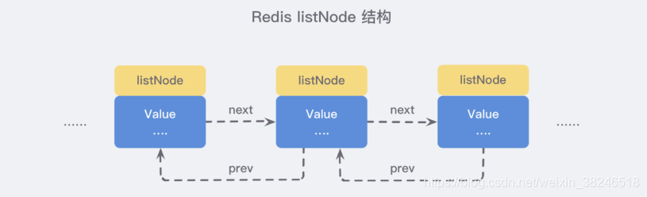

# 五种常见数据结构与使用方法

**==本文来自于网络，仅供个人学习使用。==**

一：字符串String
Redis 中的字符串是一种 动态字符串，这意味着使用者可以修改，它的底层实现有点类似于 Java 中的 ArrayList，有一个字符数组，从源码的 sds.h/sdshdr 文件 中可以看到 Redis 底层对于字符串的定义 SDS，即 Simple Dynamic String 结构：

```c

/* Note: sdshdr5 is never used, we just access the flags byte directly.
 * However is here to document the layout of type 5 SDS strings. */
struct __attribute__ ((__packed__)) sdshdr5 {
    unsigned char flags; /* 3 lsb of type, and 5 msb of string length */
    char buf[];
};
struct __attribute__ ((__packed__)) sdshdr8 {
    uint8_t len; /* used */
    uint8_t alloc; /* excluding the header and null terminator */
    unsigned char flags; /* 3 lsb of type, 5 unused bits */
    char buf[];
};
struct __attribute__ ((__packed__)) sdshdr16 {
    uint16_t len; /* used */
    uint16_t alloc; /* excluding the header and null terminator */
    unsigned char flags; /* 3 lsb of type, 5 unused bits */
    char buf[];
};
struct __attribute__ ((__packed__)) sdshdr32 {
    uint32_t len; /* used */
    uint32_t alloc; /* excluding the header and null terminator */
    unsigned char flags; /* 3 lsb of type, 5 unused bits */
    char buf[];
};
struct __attribute__ ((__packed__)) sdshdr64 {
    uint64_t len; /* used */
    uint64_t alloc; /* excluding the header and null terminator */
    unsigned char flags; /* 3 lsb of type, 5 unused bits */
    char buf[];
```

你会发现同样一组结构 Redis 使用泛型定义了好多次，为什么不直接使用 int 类型呢？

因为当字符串比较短的时候，len 和 alloc 可以使用 byte 和 short 来表示，Redis 为了对内存做极致的优化，不同长度的字符串使用不同的结构体来表示。

```c
/* Append the specified binary-safe string pointed
 * by 't' of 'len' bytes to the
 * end of the specified sds string 's'.
 *
 * After the call, the passed sds string is no longer valid and all the
 * references must be substituted with
 * the new pointer returned by the call. */
sds sdscatlen(sds s, const void *t, size_t len) {
    // 获取原字符串的长度
    size_t curlen = sdslen(s);
  
    // 按需调整空间，如果容量不够容纳追加的内容，
    //就会重新分配字节数组并复制原字符串的内容到新数组中
    s = sdsMakeRoomFor(s,len); 
    if (s == NULL) return NULL;   // 内存不足
    memcpy(s+curlen, t, len);     // 追加目标字符串到字节数组中
    sdssetlen(s, curlen+len);     // 设置追加后的长度
    s[curlen+len] = '\0';         // 让字符串以 \0 结尾，便于调试打印
    return s;
```

 注：Redis 规定了字符串的长度不得超过 512 MB。

对字符串的基本操作
MSET/MGET : 批量设置/获取键值对

MSET key1 value1 key2 value2

```c
127.0.0.1:6379> set a 11
OK
127.0.0.1:6379> get a
"11"
127.0.0.1:6379> mset b 22 c 33     //MSET key1 value1 key2 value2
OK
127.0.0.1:6379> mget a b c
1) "11"
2) "22"
3) "33"
127.0.0.1:6379> mset a aa b 11     //mset key值存在则覆盖
OK
127.0.0.1:6379> mget a b c
1) "aa"
2) "11"
3) "33"
127.0.0.1:6379> set a 11             // set key值存在则覆盖
OK
127.0.0.1:6379> mget a b c
1) "11"
2) "11"
```

EXISTS： 判断键值对是否存在

```c
127.0.0.1:6379> mget a b c
1) "11"
2) "11"
3) "33"
127.0.0.1:6379> exists a b c
(integer) 3
127.0.0.1:6379> exists a b
(integer) 2
127.0.0.1:6379> exists a b e
```

 DEL： 删除键值对

```c
127.0.0.1:6379> del a b
(integer) 2
127.0.0.1:6379> exists a b
```

EXPIRE ：设置过期时间（单位秒）

```c
127.0.0.1:6379> expire c 10
(integer) 1
127.0.0.1:6379> get c
"33"
127.0.0.1:6379> get c
```

 SET+EXISTS 等价于SETNX（SET if Not eXists）命令（不存在则创建）

```c
127.0.0.1:6379> get  a
"12"
127.0.0.1:6379> setnx a bbb
(integer) 0
127.0.0.1:6379> get a
"12"
127.0.0.1:6379> setnx b bbb
(integer) 1
127.0.0.1:6379> mget a b
1) "12"
```

如果 value 是一个整数，还可以对它使用 INCR 命令进行 原子性 的自增操作，这意味着及时多个客户端对同一个 key 进行操作，也决不会导致竞争的情况：

INCR：原子自增（整数）

```c
127.0.0.1:6379> get  a
"12"
127.0.0.1:6379> setnx a bbb
(integer) 0
127.0.0.1:6379> get a
"12"
127.0.0.1:6379> setnx b bbb
(integer) 1
127.0.0.1:6379> mget a b
1) "12"
```

 GETSET：为 key 设置一个值并返回原值

```c
127.0.0.1:6379> get a
"23"
127.0.0.1:6379> getset a aa
"23"
127.0.0.1:6379> get a
```

二：列表（list）
Redis 的列表相当于 Java 语言中的 LinkedList，注意它是链表而不是数组。这意味着 list 的插入和删除操作非常快，时间复杂度为 O(1)，但是索引定位很慢，时间复杂度为 O(n)。

我们可以从源码的 adlist.h/listNode 来看到对其的定义：

```c
/* Node, List, and Iterator are the only data structures used currently. */
typedef struct listNode {
    struct listNode *prev;
    struct listNode *next;
    void *value;
} listNode;
 
typedef struct listIter {
    listNode *next;
    int direction;
} listIter;
 
typedef struct list {
    listNode *head;
    listNode *tail;
    void *(*dup)(void *ptr);
    void (*free)(void *ptr);
    int (*match)(void *ptr, void *key);
    unsigned long len;
```

多个 listNode 可以通过 prev 和 next 指针组成双向链表



虽然仅仅使用多个 listNode 结构就可以组成链表，但是使用 adlist.h/list 结构来持有链表的话，操作起来会更加方便：


链表的基本操作

LPUSH 和 RPUSH ：分别可以向 list 的左边（头部）和右边（尾部）添加一个新元素；
LPOP和RPOP：分别可以向 list 的左边（头部）和右边（尾部）取出一个新元素；
LRANGE 命令可以从 list 中取出一定范围的元素；
LINDEX 命令可以从 list 中取出指定下表的元素，相当于 Java 链表操作中的 get(int index) 操作；

```c
127.0.0.1:6379> lpush firstList aa 
(integer) 1
127.0.0.1:6379> lpush firstList bb // 在头部添加元素
(integer) 2
127.0.0.1:6379> lpush firstList bb cc
(integer) 4
127.0.0.1:6379> lrange firstList 0 -1
1) "cc"
2) "bb"
3) "bb"
4) "aa"
127.0.0.1:6379> rpush firstList ee // 在尾部添加元素
(integer) 5
127.0.0.1:6379> lrange firstList 0 -1
1) "cc"
2) "bb"
3) "bb"
4) "aa"
```


list 实现队列

队列是先进先出的数据结构，常用于消息排队和异步逻辑处理，它会确保元素的访问顺序：

```c
127.0.0.1:6379> rpush nodeone aa bb cc dd
(integer) 4
127.0.0.1:6379> lrange nodeone 0 -1
1) "aa"
2) "bb"
3) "cc"
4) "dd"
127.0.0.1:6379> lpop nodeone
"aa"
127.0.0.1:6379> lpop nodeone
"bb"
127.0.0.1:6379> lpop nodeone
"cc"
127.0.0.1:6379> lpop nodeone
"dd"
127.0.0.1:6379> lrange nodeone 0 -1
```


 list 实现栈
栈是先进后出的数据结构，跟队列正好相反：

```c
127.0.0.1:6379> rpush nodetwo 11 22 33
(integer) 3
127.0.0.1:6379> lrange nodetwo 0 -1
1) "11"
2) "22"
3) "33"
127.0.0.1:6379> rpop nodetwo
"33"
127.0.0.1:6379> rpop nodetwo
"22"
127.0.0.1:6379> rpop nodetwo
"11"
127.0.0.1:6379> rpop nodetwo
(nil)
127.0.0.1:6379> lrange nodetwo 0 -1
(empty list or set)
```


三：字典（hash）
Redis 中的字典相当于 Java 中的 HashMap，内部实现也差不多类似，都是通过 "数组 + 链表" 的链地址法来解决部分 哈希冲突，同时这样的结构也吸收了两种不同数据结构的优点。源码定义如 dict.h/dictht 定义：

```c
typedef struct dictht {
    // 哈希表数组
    dictEntry **table;
    // 哈希表大小
    unsigned long size;
    // 哈希表大小掩码，用于计算索引值，总是等于 size - 1
    unsigned long sizemask;
    // 该哈希表已有节点的数量
    unsigned long used;
} dictht;
 
typedef struct dict {
    dictType *type;
    void *privdata;
    // 内部有两个 dictht 结构
    dictht ht[2];
    long rehashidx; /* rehashing not in progress if rehashidx == -1 */
    unsigned long iterators; /* number of iterators currently running */
} dict;
```

 table 属性是一个数组，数组中的每个元素都是一个指向 dict.h/dictEntry 结构的指针，而每个 dictEntry 结构保存着一个键值对：

```c
typedef struct dictEntry {
    // 键
    void *key;
    // 值
    union {
        void *val;
        uint64_t u64;
        int64_t s64;
        double d;
    } v;
    // 指向下个哈希表节点，形成链表
    struct dictEntry *next;
} dictEntry;
```


可以从上面的源码中看到，实际上字典结构的内部包含两个 hashtable，通常情况下只有一个 hashtable 是有值的，但是在字典扩容缩容时，需要分配新的 hashtable，然后进行 渐进式搬迁 (下面说原因)。

渐进式 rehash
大字典的扩容是比较耗时间的，需要重新申请新的数组，然后将旧字典所有链表中的元素重新挂接到新的数组下面，这是一个 O(n) 级别的操作，作为单线程的 Redis 很难承受这样耗时的过程，所以 Redis 使用 渐进式 rehash 小步搬迁：


渐进式 rehash 会在 rehash 的同时，保留新旧两个 hash 结构，如上图所示，查询时会同时查询两个 hash 结构，然后在后续的定时任务以及 hash 操作指令中，循序渐进的把旧字典的内容迁移到新字典中。当搬迁完成了，就会使用新的 hash 结构取而代之。

 

扩缩容的条件


正常情况下，当 hash 表中 元素的个数等于第一维数组的长度时，就会开始扩容，扩容的新数组是 原数组大小的 2 倍。不过如果 Redis 正在做 bgsave(持久化命令)，为了减少内存也得过多分离，Redis 尽量不去扩容，但是如果 hash 表非常满了，达到了第一维数组长度的 5 倍了，这个时候就会 强制扩容。

当 hash 表因为元素逐渐被删除变得越来越稀疏时，Redis 会对 hash 表进行缩容来减少 hash 表的第一维数组空间占用。所用的条件是 元素个数低于数组长度的 10%，缩容不会考虑 Redis 是否在做 bgsave。

 

字典的基本操作


hash 也有缺点，hash 结构的存储消耗要高于单个字符串，所以到底该使用 hash 还是字符串，需要根据实际情况再三权衡：

```c

127.0.0.1:6379> hset books java "111 aaa"
(integer) 1
127.0.0.1:6379> hmset books java "java" hashlearn "learn hash" // 批量设置
OK
127.0.0.1:6379> hmget books java hashlearn
1) "java"
2) "learn hash"
127.0.0.1:6379> hgetall books
1) "java"
2) "java"
3) "hashlearn"
4) "learn hash"
```


四：集合 set


Redis 的集合相当于 Java 语言中的 HashSet，它内部的键值对是无序、唯一的。它的内部实现相当于一个特殊的字典，字典中所有的 value 都是一个值 NULL。

集合 set 的基本使用

由于该结构比较简单，我们直接来看看是如何使用的：

sadd： 添加元素

smembers： 乱序输出集合

sismember：某元素是否存在

scard：集合长度

spop：弹出一个元素

```c
127.0.0.1:6379> sadd setone aa
(integer) 1
127.0.0.1:6379> sadd setone aa bb cc dd
(integer) 3
127.0.0.1:6379> smembers setone
1) "dd"
2) "cc"
3) "bb"
4) "aa"
127.0.0.1:6379> sismember setone aa
(integer) 1
127.0.0.1:6379> scard setone
(integer) 4
127.0.0.1:6379> spop setone
"bb"
127.0.0.1:6379> smembers setone
1) "dd"
2) "cc"
3) "aa"
```

五：有序列表 zset


这可能使 Redis 最具特色的一个数据结构了，它类似于 Java 中 SortedSet 和 HashMap 的结合体，一方面它是一个 set，保证了内部 value 的唯一性，另一方面它可以为每个 value 赋予一个 score 值，用来代表排序的权重。

它的内部实现用的是一种叫做 「跳跃表」 的数据结构，由于比较复杂，所以在这里简单提一下原理就好了：（后续详细讲解）


想象你是一家创业公司的老板，刚开始只有几个人，大家都平起平坐。后来随着公司的发展，人数越来越多，团队沟通成本逐渐增加，渐渐地引入了组长制，对团队进行划分，于是有一些人又是员工又有组长的身份。

再后来，公司规模进一步扩大，公司需要再进入一个层级：部门。于是每个部门又会从组长中推举一位选出部长。

跳跃表就类似于这样的机制，最下面一层所有的元素都会串起来，都是员工，然后每隔几个元素就会挑选出一个代表，再把这几个代表使用另外一级指针串起来。然后再在这些代表里面挑出二级代表，再串起来。最终形成了一个金字塔的结构。

想一下你目前所在的地理位置：亚洲 > 中国 > 某省 > 某市 > ....，就是这样一个结构！

 

有序列表 zset 基础操作
zadd：添加 格式：zadd 表名 权重 元素值

zrange：按权重顺序输出

zrevrange：按权重逆序输出

zcard：有序列表长度

zscore：元素权重

zrank：元素排名

zrangebyscore：按权重范围顺序进行输出

zrem：删除元素

```c
127.0.0.1:6379> zadd book 8 aa 9 bb 10 cc
(integer) 3
127.0.0.1:6379> zrange book 0 -1
1) "aa"
2) "bb"
3) "cc"
127.0.0.1:6379> zrevrange book 0 -1
1) "cc"
2) "bb"
3) "aa"
127.0.0.1:6379> zcard book
(integer) 3
127.0.0.1:6379> zscore book aa
"8"
127.0.0.1:6379> zrank book bb
(integer) 1
127.0.0.1:6379> zrank book aa
(integer) 0
127.0.0.1:6379> zrangebyscore book 0 9
1) "aa"
2) "bb"
//# 根据分值区间 (-∞, 8.91] 遍历 zset，同时返回分值。
//# inf 代表 infinite，无穷大的意思。
127.0.0.1:6379> zrangebyscore book -inf 9 withscores
1) "aa"
2) "8"
3) "bb"
4) "9"
127.0.0.1:6379> zrem book aa
(integer) 1
127.0.0.1:6379> zrange book 0 -1
1) "bb"
2) "cc
```


